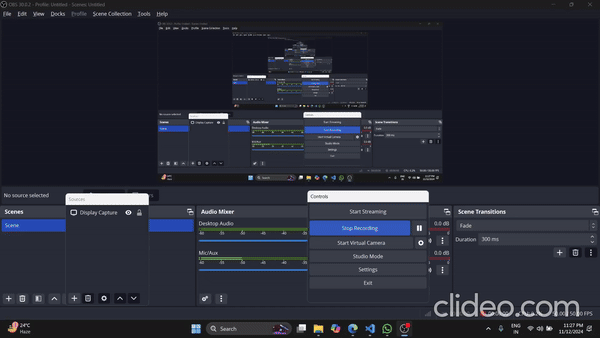

# YouTube Summarizer and Q&A App

This Streamlit application enables users to input a YouTube video URL, summarize the video transcript, generate Frequently Asked Questions (FAQs), and answer specific user questions based on the video content. Leveraging Google Generative AI and the YouTube Transcript API, the app delivers seamless multi-language support for summarization, FAQs, and contextual Q&A.

## Demo



## Key Features

1. **Video Transcript Extraction**: Extracts the YouTube video transcript and translates it if needed.
2. **Concise Summaries**: Summarizes the transcript into key points for quick video insights.
3. **FAQ Generation**: Generates commonly asked questions based on the video content.
4. **Question Answering**: Provides answers to user-specific questions using contextual analysis of the transcript.
5. **Multi-language Support**: Supports transcript extraction and automatic translation from various languages to English.

## Prerequisites

- **Python**: Version 3.10 or higher
- **Google API Key**: For accessing Google’s Generative AI models
- **Environment File (.env)**: Add a `.env` file in the project root directory with the following format:
    ```plaintext
    google_api=<your_google_api_key>
    ```

## Installation

1. **Clone the Repository**:
    ```bash
    git clone <repository_url>
    cd <repository_name>
    ```

2. **Set Up a Virtual Environment** (recommended):
    ```bash
    python -m venv venv
    source venv/bin/activate  # MacOS/Linux
    venv\Scripts\activate     # Windows
    ```

3. **Install Dependencies**:
    ```bash
    pip install -r requirements.txt
    ```

4. **Configure API Key**:
    - Create a `.env` file in the project root and add your Google API key.

## Usage

1. **Launch the Streamlit App**:
    ```bash
    streamlit run app.py
    ```

2. **App Workflow**:
    - **Enter YouTube URL**: Paste a YouTube video URL and click "Submit."
    - **View Summary and FAQs**: After submission, a detailed summary and FAQs based on the content will display.
    - **Ask Specific Questions**: In the "Ask a Question" section, submit a question about the video to receive a contextual answer.

## Code Overview

### Key Functions

- **`extract_video_id(url)`**: Extracts the video ID from a YouTube URL.
- **`fetch_and_translate_transcript(video_id)`**: Fetches the transcript, with translation if needed.
- **`summarize_text(transcript)`**: Summarizes video content concisely.
- **`generate_faq(transcript)`**: Creates a list of FAQs based on the transcript.
- **`question_text(transcript, question)`**: Responds to user questions based on the transcript content.
- **`initialize_chatbot_context(transcript)`**: Sets up a conversational context for Q&A.
- **`qa_chatbot(conversation_history, user_question)`**: Engages in a Q&A session with the user.

### Supported Languages

This app supports transcript extraction and translation from various languages, including English, Spanish, French, German, Japanese, Chinese, Korean, Russian, Portuguese, and Italian.

## Technologies Used

- **Streamlit**: For creating an interactive web interface.
- **Google Generative AI**: To generate summaries, FAQs, and answers based on video content.
- **YouTube Transcript API**: For retrieving YouTube transcripts.
- **dotenv**: For managing environment variables securely.
- **Natural Language Processing (NLP)**: The app uses advanced NLP models to enhance video summarization and Q&A accuracy.

## Project Structure

```plaintext
.
├── assets
│   ├── demo.gif
├── notebook
│   └── exp.ipynb           # Experimental development notebook
├── src
│   ├── __init__.py
│   └── main.py             # Core functions for summarizing and Q&A
├── app.py                  # Main Streamlit application
├── requirements.txt        # List of dependencies
├── .env                    # Environment configuration for API keys
└── README.md               # Project documentation
```

## Contributing

Contributions are welcome! Feel free to open a pull request or an issue to suggest changes or improvements.

## License

This project is open-source and available under the MIT License. See the [LICENSE](LICENSE) file for details.